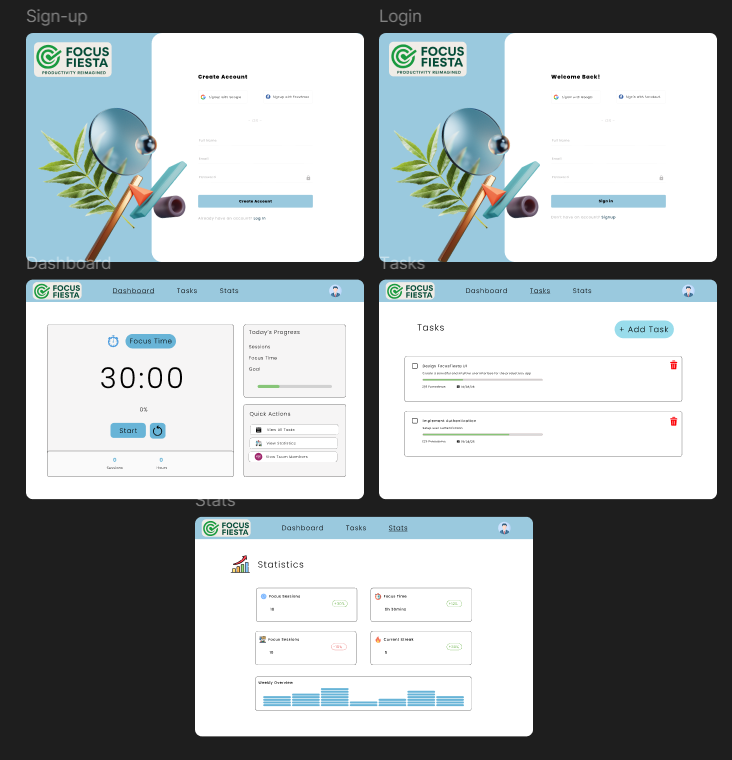
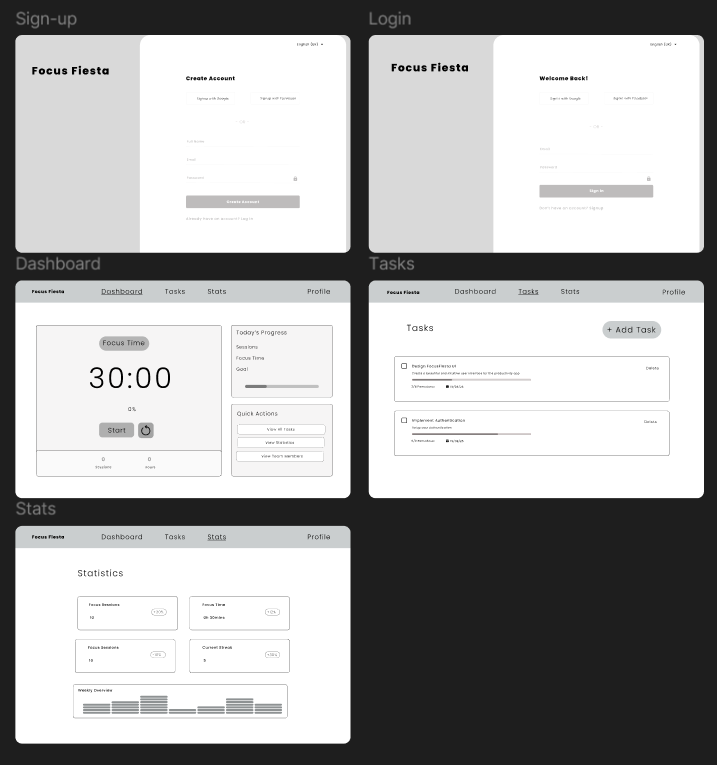

## FocusFiesta Design Documentation

### Overview
This document outlines the design principles, decisions, and resources for the FocusFiesta project. The goal is to create a clean, user-friendly interface with a light blue and white theme.

FocusFiesta is a productivity app designed to help users manage tasks and focus sessions in a visually appealing, distraction-free environment. The design emphasizes clarity, simplicity, and motivation.

### Figma Design
You can view the latest designs and wireframes in our Figma project:

- Low Level Design and High Level Design [Figma Design Link](https://www.figma.com/design/l9r3elRU9guEO9cQuL4qSO/FocusFiesta?node-id=0-1&t=gj1UbveoFvebnnTE-1)

#### Screenshots
**High Level Design (HLD):**

**Low Level Design (LD):**

#### Example Screens
- **Home Dashboard:** Displays active focus sessions, quick stats, and motivational quotes.
- **Task Manager:** Allows users to add, edit, and organize tasks with color-coded priorities.
- **Session Timer:** Minimalist timer interface with progress visualization.

### Color Palette
- **Primary Color:** Light Blue (`#9AC9DE`)
- **Background:** White (`#FFFFFF`)

#### Usage
- Buttons, highlights, and icons use the primary light blue for emphasis.
- Backgrounds and cards use white for a clean look.
- Shadows and borders use subtle gray tones for depth.

### Typography
Use clean, modern sans-serif fonts for readability and simplicity.

Recommended fonts: Inter, Roboto, or Open Sans.

### Layout & Wireframes
Refer to the Figma link above for detailed layouts and wireframes of all screens.

All screens follow a grid-based layout for consistency. Spacing and padding are generous to reduce clutter.

### User Flow
The user flow is designed to be intuitive, minimizing friction and focusing on core tasks. See Figma for diagrams.

1. User lands on the dashboard.
2. Starts a focus session or reviews tasks.
3. Completes tasks and receives feedback.
4. Can view session history and productivity stats.

### Accessibility
Ensure sufficient contrast between text and background. Use accessible font sizes and clear labels.

- All interactive elements have clear focus states.
- Color contrast meets WCAG AA standards.
- Icons have descriptive alt text.
- Supports keyboard navigation.

### Design Guidelines for Contributors
- Maintain consistency with the color palette and typography.
- Follow wireframes and layouts as per Figma.
- Prioritize usability and accessibility in all design decisions.

- Use reusable components for buttons, cards, and forms.
- Test designs on multiple screen sizes.
- Document any new design patterns in this file.

